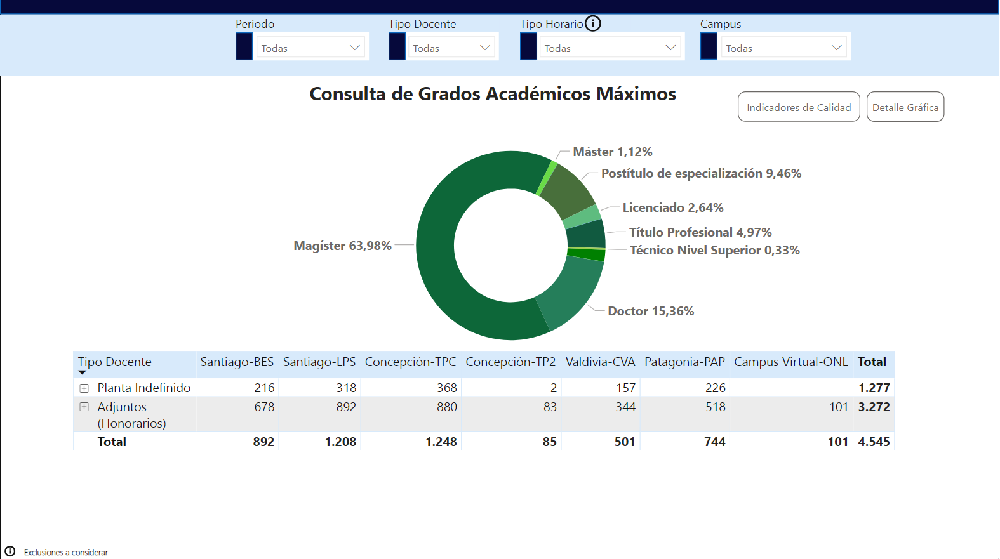
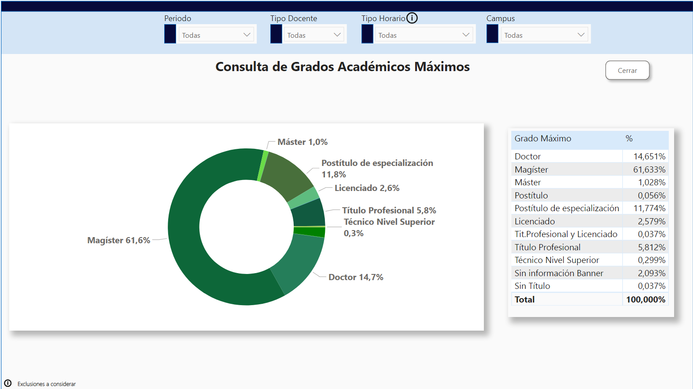
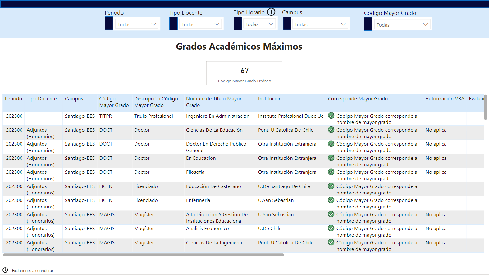

#Reporte 1

## Reporte para profundizar metricas de los académicos que prestan servicios en la universidad

Vista General: Muestra la composición por sede y contrato para el académico de su maximo grado de especialización, con el objetivo de mantener un indice de postgrados sobre el 70%

Esta vista cuenta con un botón donde se profundiza este objetivo

Tambien se profundiza en la distribucion del grafico de anillo

Vista 2: Profundiza el detalle de la Vista 1 con una base extraible donde las sedes pueden gestionar la información de los académicos, tambien esta vista contrasta la información de grados que presenta el académico con la que esta ingresada en el sistema de gestión de la universidad, tambien presenta información complementaria con respecto a la evaluación docente y excepciones para académicos pueda impartir clases pero no cuentan con postgrado 

Vista 3: Contrasta la información que presenta la universidad con el tipo de contrato que tiene el docente y el cual esta ingresado en el sistema de gestión de la universidad

Modelo de Datos: La información obtenida para hacer este reporte se cargaba mediante Excel, Reporte 16 con la información de los grados del académico, Employee Data con la información de los académicos contratados por la universidad, Reporte 1 para la programación de los cursos impartidos, Evaluación docente, lista de Excepciónes, SOISBGI para obtener la institución donde el académico obtuvo su grado, y las tablas de orden para organizar los datos de acuerdo a la manera requerida.

Video para enseñar su funcionamiento: "https://youtu.be/eWat9oiDwkw"