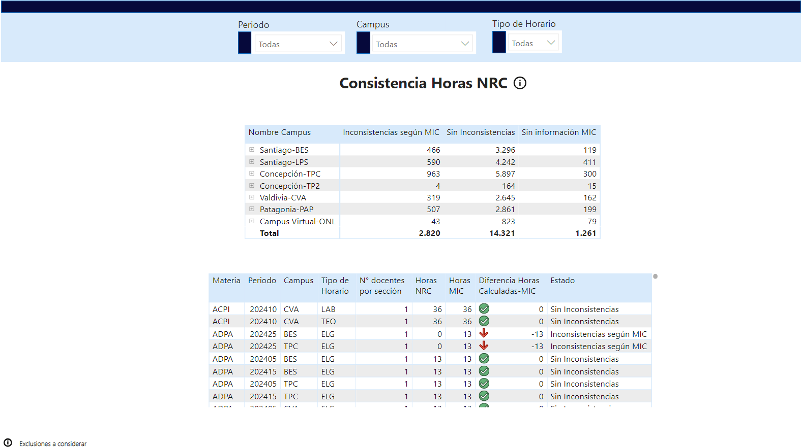
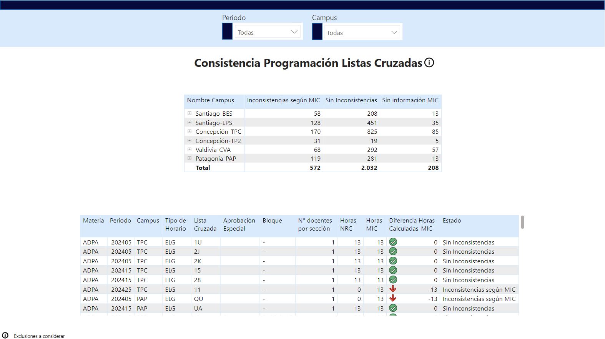

#Reporte 2

## Reporte para monitorear la consistencia en la cantidad de horas de las asignaturas programadas y que estas cumplan con los planes de estudio preestablecidos

Vista 1: Centra la visualización en la consistencia de asignaturas que no comparten con otras carreras, Cuenta con dos tablas, en la primera la revision se divide en 3 estatus y en las sedes para facilitar la segmentacion de los datos, la segunda tabla muestra el detalle de las asignaturas

Vista 2: Centra la revisión igual que la Vista 1 pero centrada en las asignaturas que se imparten en mas de una carrera y comparten sala.

Vista 3: Esta visualización revisa aquellas asignaturas que en el sistema de gestión de la universidad no cuentan con la información de la cantidad de horas del plan de estudio

Modelo de Datos: La información obtenida para este reporte se obtenia en Excel, Reporte 1 2024 para obtener la programación de la asignaturas, Consulta MIC para obtener la información de los planes de estudio, Carreras para obtener los nombres de las carreras y poder complementar los código de carrera y la tabla Orden para organizar de acuerdo a lo requerido

Video para enseñar su funcionamiento: : "https://youtu.be/UxDK34Verkc"