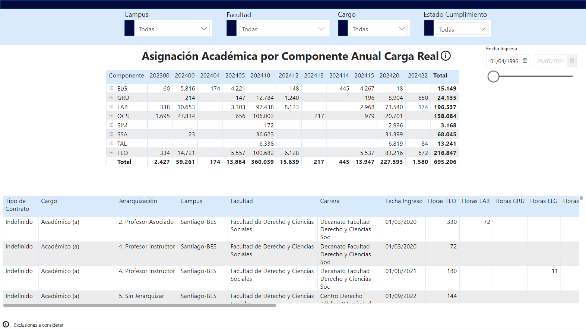

#Reporte 3

## Reporte para monitorear el cumplimiento por contrato de las horas pactadas por el académico

Vista 1: Visualización correspondiente al cumplimiento del año 2024 para académicos contratados por la institución, cuenta con 5 estados los cuales representan la cantidad de horas que mantiene el académico, también se presenta una pequeña tabla donde se desglosa como se distribuye en el año la carga del académico

Vista 2: Profundiza la Vista 1 con el detalle de el tipo de curso al que corresponde las horas asignadas al académico, cuenta con una tabla general para facilitar la visualizacion y segmentación de datos y una tabla secundaria para ver el detalle

Modelo de Datos: La información obtenida para este reporte se obtenia en Excel, Employee Data contenía la información de los docentes contratados, Panel de Cumplimiento la cantidad de horas que los académicos debían cumplir, CG3 calculaba la cantidad de horas que tenia el docente programado, Asistencia era información complementaria para explicar docentes que no cumplian con sus horas pactadas y tablas de Orden para la organización requerida de los datos.

Para mas detalle, el informe publicado: "https://app.powerbi.com/reportEmbed?reportId=17f8220f-9801-415f-9f1f-a141223528da&autoAuth=true&ctid=60dac1b9-6047-489a-a134-b070386cccf7"