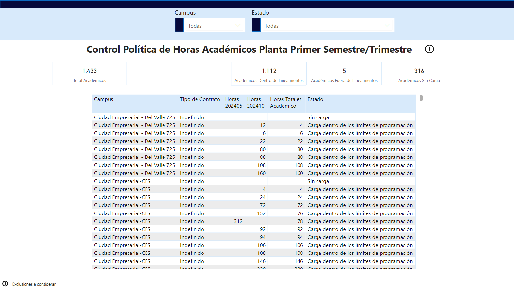
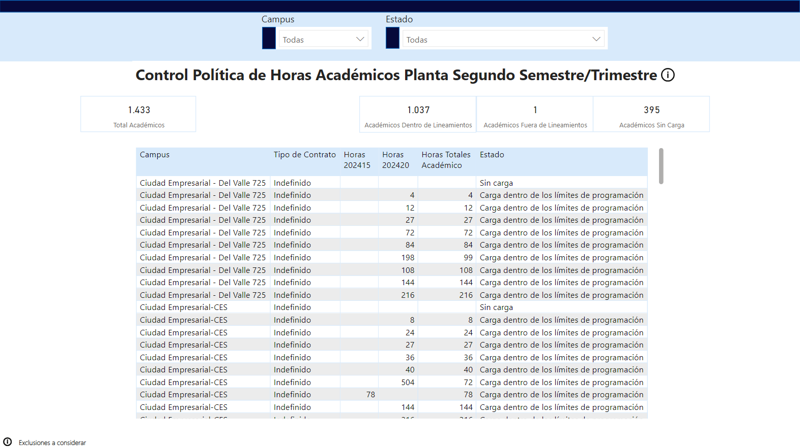

#Reporte 4

## Reporte para monitorear el cumplimiento de la política establecida para el máximo de horas que los académicos contratados pueden impartir

Vista 1 y 2: La visualización cuenta con dos pestañas una dedicada a cada semestre/trimestre, ambas cuentan con la información para monitorear a los académicos contratados y la cantidad de horas que imparten, se dividen en 3 estados para facilitar su segmentación y monitoreo.

Modelo de Datos: La información obtenida para este reporte se obtenia en Excel, Employee Data contenía la información de los docentes contratados y CG3 la cantidad de horas que impartian

Video para enseñar su funcionamiento: "https://youtu.be/-anKh2RA3EA"