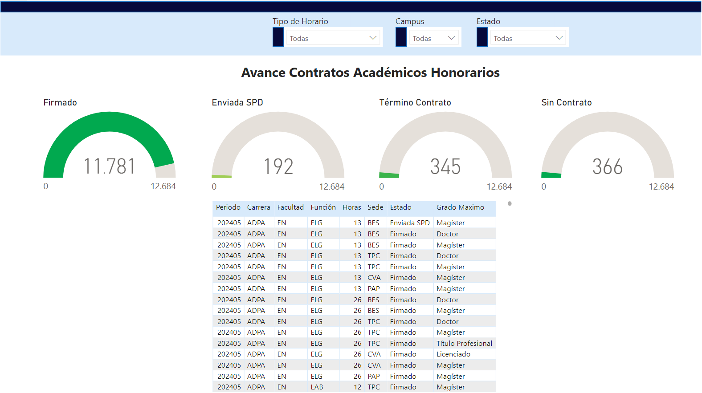
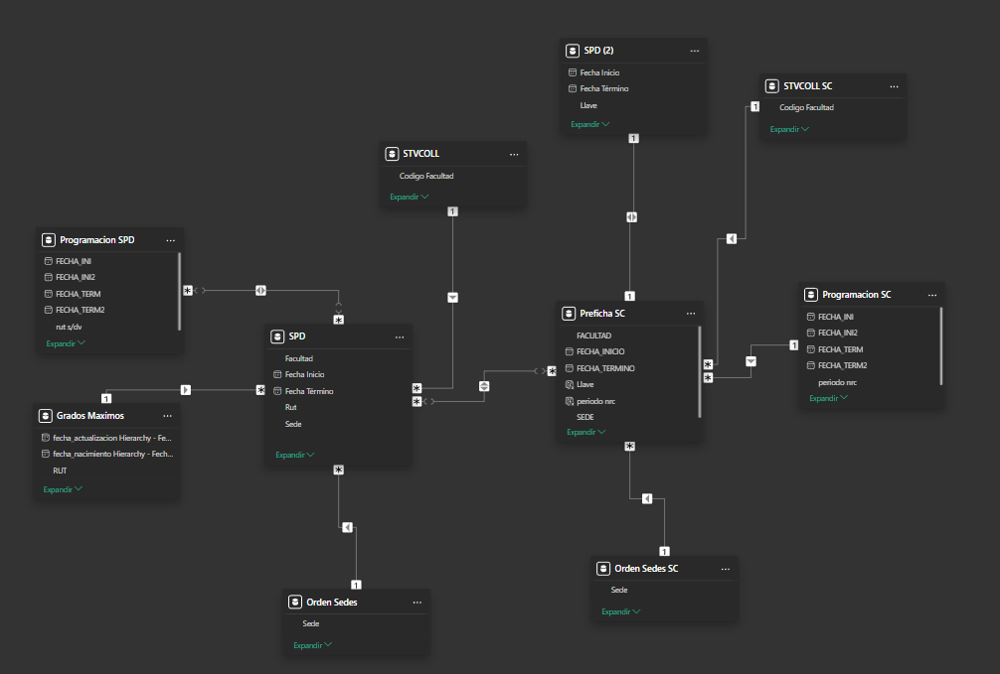

#Reporte 5

## Reporte para monitorear el avance de la revisión a horas de pago de académicos a honorarios

Vista 1 : Visualizacion correspondiente a la totalidad de documentos generados para pago de académicos a honorarios, cuenta con 4 medidores, los 3 primeros hacen referencia a los documentos ya procesados y el último refiere a aquellos académicos a los cuales aun tienen pendiente su revisión. La tabla detalla las horas a pago ya revisadas y procesadas.

Vista 2: Visualización correspondiente a la revisión actual de académicos que tengan pendiente su revisión, cuenta con 4 medidores, el primero con la totalidad de los que estan pendientes, y los restantes hacen referencia a las revisiones que hagan los encargados. La tabla detalla la revisión de los pendientes que esta en curso para que puedan ser procesados.

Modelo de datos: La información obtenida para este reporte se obtenia en Excel y un documento compartido en Sharepoint. SPD contenia los documentos ya procesados de horas a pago, Prefichas SC las horas a revisar, las tablas de programación como información complementaria para facilitar la revisión, STVCOL para los nombres de las facultades y las tablas de orden para organizar los datos.

Para mas detalle, el informe publicado: "https://app.powerbi.com/reportEmbed?reportId=ef2eb12c-89f8-49f6-b95c-b804eea04b26&autoAuth=true&ctid=60dac1b9-6047-489a-a134-b070386cccf7"